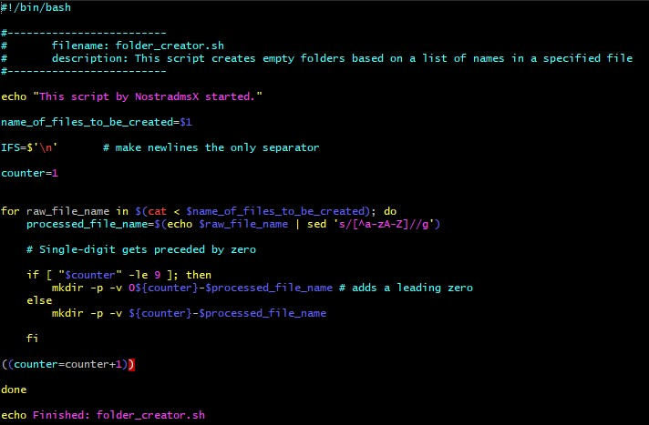
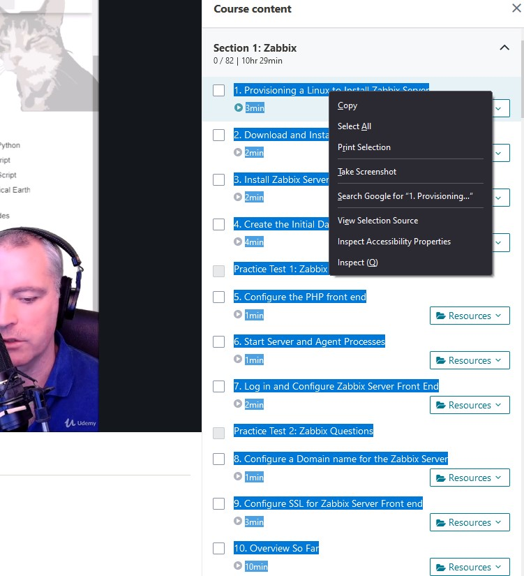
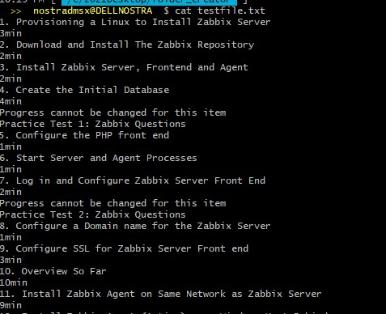
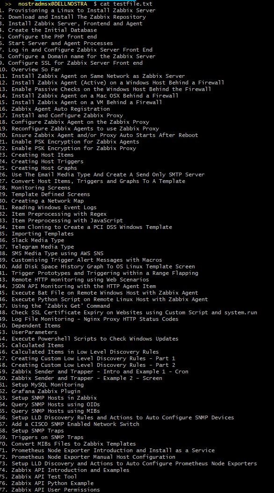
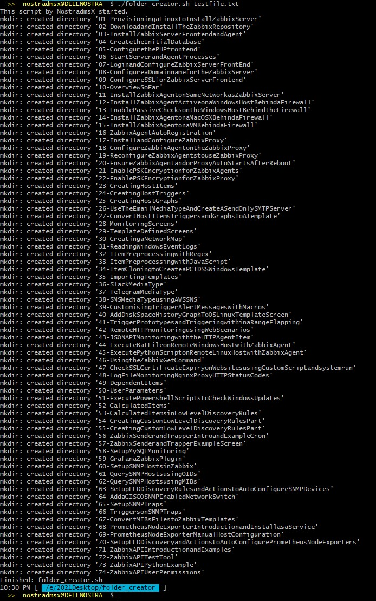
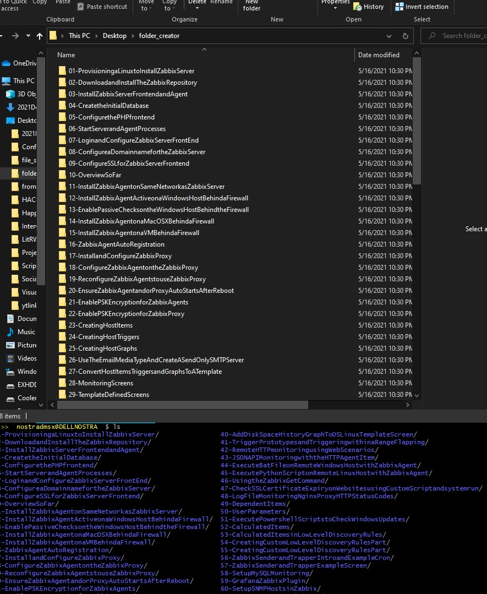

# Folder Creator - A Bash Script

This is a script I wrote to help me create folders based on a file that contains word, phrases, etc that will be used as folder name. Only the alphabets will be preserved and prefixed with two digit numbering to create the folder names. This is also a simple, yet practical exercise for my bash scripting skills. Feel free to fork, improve, comment, and suggest on how I can improve this script.

# The Bash Script Code:

Seen from Cmder:

# Test File:

Test file source is from an online course I am taking and I copied and paste what to a text file.

Test File Raw that contains unwanted text

Running the command:  `cat testfile.txt | grep -v min | grep -v ^Progress | grep -v ^Practice | grep -v ^Quiz > testfile.txt` creates:

# Running the Script:

## 	./folder_creator.sh testfile.txt

## 	Results:

